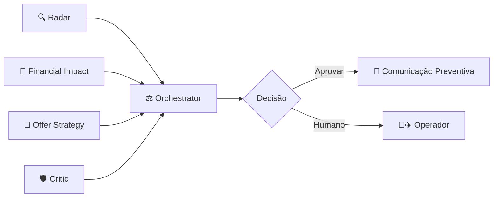
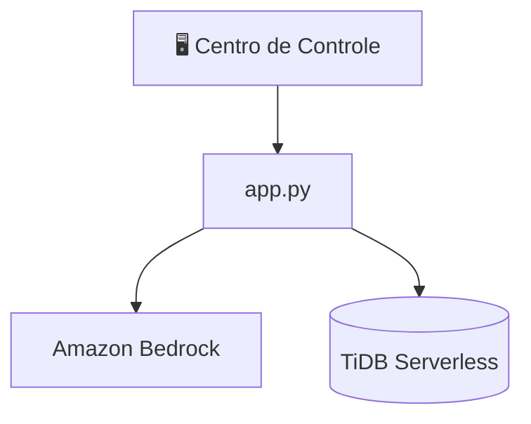

# REVENUE GUARD

**Predict the Risk. Protect the Revenue. Preserve the Journey.**

REVENUE GUARD is an AI-powered Swarm Architecture designed for airlines to predict and resolve overbooking scenarios 24 hours before the flight. By shifting from a reactive airport crisis to a proactive digital negotiation, it preserves customer satisfaction while significantly reducing operational costs and legal liabilities.


---

## 🔴 Live Demo & Pitch

- **Interactive Pitch Deck**: [https://feliperafaellesilva-bot.github.io/TiDB/](https://feliperafaellesilva-bot.github.io/TiDB/)
- **60-Second Video Demo**: [Insert YouTube Unlisted Link Here]
- **Executive Summary PDF**: [analise_estrategica_cdo_revenue_guard.pdf](./analise_estrategica_cdo_revenue_guard.pdf)

---

## Problem

Airlines face massive financial and reputational damage when handling overbooked flights reactively at the departure gate. Identifying volunteers at the last minute leads to chaotic operations, mandatory high compensations, hotel and transport costs, and significant risks of moral damage lawsuits. The core issue is not the lack of data, but the inability to anticipate the exact impact and resolve it proactively before the passenger leaves for the airport.

## Solution

REVENUE GUARD shifts the resolution window from the boarding gate (T-0) to the opening of online check-in (T-24h). Using a Multi-Agent Swarm AI, the system predicts overbooking capacity, calculates the financial threshold for compensation, and automatically reaches out to predisposed passengers via WhatsApp with a fair, voluntary offer. If accepted, the issue is resolved seamlessly and legally.

## How It Works

1. **Detection (T-24h)**: At the exact moment online check-in opens or an aircraft downgauge occurs, the system crosses sold tickets with physical capacity.
2. **Analysis**: AI agents calculate the cost of a gate crisis versus an upfront digital offer.
3. **Negotiation**: The system identifies flexible passengers (e.g., solo leisure travelers) and sends an automated offer via WhatsApp (e.g., "$100 voucher to fly 2 hours later").
4. **Resolution**: Once accepted, the system instantly rebooks the passenger, securing a vacant seat for the originally overbooked flight.

## Multi-Agent Architecture

Our intelligence relies on a decentralized, collaborative swarm of specialized agents working together to form a robust decision matrix:



- **Radar**: Scans PSS/TiDB Cloud for capacity anomalies.
- **Financial Impact**: Calculates margins and cost-benefit ratios.
- **Offer Strategy**: Filters CRM for the best candidates for voluntary changes.
- **Critic (Devil's Advocate)**: Challenges the plan (e.g., verifies if the alternative flight actually has seats).
- **Orchestrator**: Consolidates advice, triggers communications, and logs compliance data.

## System Architecture



## Key Features

- **Predictive Alerting**: Early detection of potential overbookings.
- **Swarm Consensus**: Decisions backed by multi-agent validation.
- **Automated WhatsApp Negotiation**: Seamless communication interface for the passenger.
- **Live C-Level Cockpit**: A real-time dashboard tracking potential savings and operational health.
- **Immutable Audit Trails**: Full legal compliance logging for ANAC Resolution 400.

## Tech Stack

- **Database**: TiDB Cloud Serverless (MySQL Compatible, HTAP)
- **AI/LLM**: Amazon Bedrock
- **Embeddings**: Titan Embeddings V2
- **Reasoning Engine**: Claude Haiku 4.5
- **Backend/Data**: Python (Pandas, SQLAlchemy, Boto3)
- **Frontend**: Streamlit / React (TailwindCSS)

## Getting Started

### Prerequisites
- Python 3.9+
- TiDB Cloud Serverless account
- AWS Account with Bedrock access

### Installation

1. Clone the repository and navigate to the root directory.
2. Install the required packages:
   ```bash
   pip install -r requirements.txt
   ```
3. Set up your environment variables:
   Copy `.env.example` to `.env` and fill in your credentials.
   ```bash
   cp .env.example .env
   ```
4. Run the control center application:
   ```bash
   streamlit run app.py
   ```

## Repository Structure

- `docs/`: Contains the GitHub Pages live demo (`index.html`).
- `core/`: Core database connection and multi-agent logic.
- `frontend/`: React components for potential web UI extensions.
- `app.py`: Streamlit C-Level Cockpit dashboard.
- `schema.sql`: Database schema for TiDB.

## Business Value

By transforming a reactive crisis into a proactive negotiation, REVENUE GUARD delivers substantial potential estimated savings based on scenario simulation:
- **Cost Reduction**: Replaces expensive mandatory gate compensations, hotels, and legal fees with a controlled, lower-cost digital voucher.
- **Legal Protection**: Acts strictly under voluntary rebooking guidelines, mitigating moral damage lawsuits.
- **Brand Protection**: Prevents chaotic boarding gate experiences, increasing customer satisfaction.

## Responsible AI & Governance

- **Human-in-the-Loop**: The Orchestrator can escalate complex or high-risk edge cases to a human operator.
- **Audit Trail**: Every AI decision, calculation, and passenger acceptance is logged immutably for regulatory compliance.
- **Explainability**: The C-Level Cockpit provides transparent metrics on *why* an offer was triggered.
- **No Absolute Promises**: The system relies on predictive probabilities and voluntary acceptance; it mitigates risks but does not claim 100% elimination of all operational disruptions.

## Roadmap

- [x] C-Level Cockpit Prototype
- [x] Swarm AI Logic & Multi-Agent Architecture Setup
- [ ] Direct PSS (Amadeus/Sabre) Integration
- [ ] Legal Homologation for Automated WhatsApp Vouchers

## License

This project is licensed under the MIT License - see the [LICENSE](LICENSE) file for details.

---

**Problem** (Gate Chaos) → **Risk** (High Costs & Lawsuits) → **Anticipation** (T-24h Detection) → **Intelligence** (Swarm AI) → **Decision** (Calculated Offer) → **Action** (WhatsApp Negotiation) → **Impact** (Preserved Revenue & Happy Passengers).
