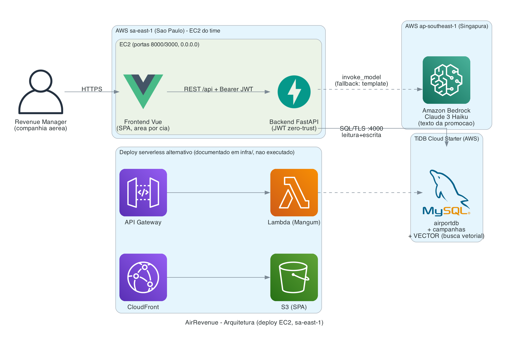

# AirRevenue — Arquitetura do Sistema

## Visão de componentes

| Camada | Tecnologia | Onde roda | Responsabilidade |
|--------|-----------|-----------|------------------|
| Apresentação | Vue 3 (Vite, SPA) | EC2 sa-east-1 (porta 3000 dev / build estático) | Área por companhia: login, recomendações, campanhas |
| Aplicação | FastAPI + Uvicorn | EC2 sa-east-1 (porta 8000, `0.0.0.0`) | API REST, auth JWT, regras de negócio, orquestração |
| Dados | TiDB Cloud Starter | AWS (cluster do time) | `airportdb` (RO) + campanhas (RW) + coluna VECTOR |
| IA | Amazon Bedrock (Claude 3 Haiku) | ap-southeast-1 | Geração do texto promocional |

## Fluxo principal (recomendação → campanha)

1. Analista faz **login** na área da sua companhia → backend valida e emite **JWT** com `airline_id`.
2. Frontend chama `GET /api/recommendations` (Bearer JWT) → backend consulta o TiDB
   **filtrando pelo `airline_id` do token** → retorna voos ociosos ranqueados (RN-001).
3. Analista escolhe um voo → `GET /api/flights/{id}/targets` → passageiros frequentes por
   propensão (RN-002), contato mascarado.
4. Analista pede texto → `POST /api/campaigns/generate-copy` → backend chama **Bedrock**
   (ou usa template no fallback).
5. Analista salva → `POST /api/campaigns` → grava `campaign` + `campaign_target` no TiDB.
6. `GET /api/search` → **busca vetorial** (`VEC_COSINE_DISTANCE`) sobre `flight_notes`.

## Segurança — Zero-Trust

- **Autenticação obrigatória** em todas as rotas de dado; nenhuma rota confia em `airline_id`
  vindo do cliente — sempre do token assinado (HS256, exp ≤ 60 min).
- **Isolamento multi-tenant** garantido no repositório de dados: todo SQL de negócio recebe o
  `tenant_id` do token; recurso de outro tenant retorna 404 (não 403, para não vazar existência).
- **Senhas** com hash bcrypt; **segredos** apenas em `.env` (git-ignored) — o repo é público
  com Secret Scanning/Push Protection.
- **CORS** restrito à origem do frontend; **erros** genéricos ao cliente (sem stack/PII).
- **Superfície mínima:** só as portas 8000/3000 expostas (limite da EC2 do hackathon).

## Decisão de deploy

A conta do hackathon (chave *bedrock-only*) **nega** `lambda:*`, `cloudformation:*`,
`s3:CreateBucket`, `cloudfront:*` e `ec2:Describe*` (verificado via AWS CLI). Portanto:

- **Executado:** deploy na **EC2 do time** (sa-east-1) — uvicorn servindo a API e o build
  estático do Vue. É o caminho recomendado pelo guia e pontua os 8 pts de "Publicado na AWS".
- **Documentado (não executado):** `infra/template.yaml` (SAM: API Gateway + Lambda via Mangum)
  e pipeline S3+CloudFront para a SPA — prontos para uma conta com permissões amplas (Fase 2).

## Portabilidade

O código de negócio não conhece o runtime: em EC2 sobe com `uvicorn app.main:app`; em Lambda,
o mesmo `app` é embrulhado com `Mangum(app)`. A troca é de uma linha no entrypoint.
