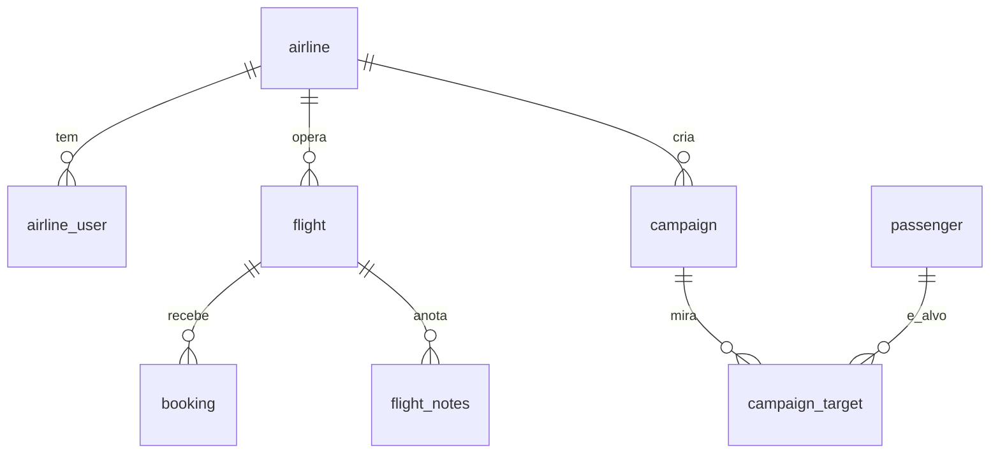

# AirRevenue — Especificação Técnica

## 1. Escopo do Projeto

### 1.1 Objetivo
Recomendar promoções para voos com baixa ocupação e permitir que cada companhia crie
campanhas direcionadas a passageiros frequentes, com isolamento multi-tenant e segurança
zero-trust.

### 1.2 Fora de Escopo
- Envio real de e-mails/push (as campanhas são **persistidas**, não disparadas).
- Precificação dinâmica em tempo real / integração com PSS de produção.
- Cadastro self-service de companhias (as contas são pré-provisionadas por seed).

### 1.3 Fases de Entrega
- **Fase 1 (hackathon):** auth por companhia, recomendação de voos ociosos, alvos por
  propensão, geração de texto por IA, criação/listagem de campanhas, busca vetorial.
- **Fase 2 (futuro):** disparo real, A/B de textos, feedback de conversão, deploy serverless.

## 2. Requisitos Funcionais

- **RF-001 — Autenticação por companhia:** login com usuário/senha da companhia retorna um
  JWT contendo `airline_id`. *Aceite:* credencial inválida retorna 401; token expira em ≤60 min.
- **RF-002 — Isolamento multi-tenant:** toda consulta filtra pelo `airline_id` do token, nunca
  por parâmetro do cliente. *Aceite:* companhia A não obtém nenhum voo/campanha da companhia B.
- **RF-003 — Recomendação de voos ociosos:** listar voos futuros da companhia ordenados por
  score de oportunidade (assentos ociosos × urgência). *Aceite:* retorna voo, rota, capacidade,
  vendidos, ociosos, % ociosidade, score.
- **RF-004 — Alvos de campanha (propensão):** para um voo, listar passageiros frequentes da
  companhia com maior propensão (histórico de voos na companhia/rota). *Aceite:* retorna lista
  ordenada por score, com dados de contato mascarados na UI.
- **RF-005 — Geração de texto promocional (IA):** gerar via Bedrock um texto curto de promoção
  para o voo/rota. *Aceite:* retorna texto ≤ 500 caracteres; se Bedrock falhar, retorna template.
- **RF-006 — Criar campanha:** persistir uma campanha (voo alvo, desconto, texto, público) no
  TiDB, vinculada ao `airline_id`. *Aceite:* campanha criada aparece só para a companhia dona.
- **RF-007 — Listar campanhas:** listar campanhas da companhia. *Aceite:* ordenadas por data.
- **RF-008 — Busca vetorial (semântica):** dado um texto (ex.: "voos noturnos para o litoral"),
  encontrar notas de voo semanticamente próximas via `VEC_COSINE_DISTANCE`. *Aceite:* retorna
  top-5 por similaridade.

## 3. Requisitos Não-Funcionais

- **RNF-001 — Segurança (zero-trust):** JWT assinado (HS256) com expiração curta; CORS restrito
  à origem do frontend; sem confiança em input do cliente para tenant; senhas com hash (bcrypt);
  segredos só em `.env` (nunca commitados). *Métrica:* 0 segredos no repo; 100% das rotas de
  dado exigem token válido.
- **RNF-002 — Performance:** Bedrock em Singapura tem centenas de ms de latência; chamadas de IA
  são pontuais (1 por geração), nunca em loop. *Métrica:* recomendação < 1s (sem IA); geração de
  texto < 4s.
- **RNF-003 — Portabilidade de deploy:** roda na EC2 (uvicorn 0.0.0.0:8000) e é empacotável para
  Lambda (Mangum) sem mudança de código de negócio.
- **RNF-004 — Observabilidade:** logs estruturados sem PII; erros retornam mensagem genérica ao
  cliente.

## 4. Integrações

- **INT-001 — Backend ↔ TiDB:** SQL sobre TLS (porta 4000, `--ssl-ca`). Bidirecional (lê
  operacional, grava campanhas). Real-time.
- **INT-002 — Backend ↔ Amazon Bedrock:** `bedrock-runtime` em ap-southeast-1, Claude 3 Haiku,
  on-demand. Unidirecional (prompt → texto). *Fallback:* template local.
- **INT-003 — Frontend ↔ Backend:** REST/JSON sobre HTTP(S), `Authorization: Bearer <jwt>`.

## 5. Modelo de Dados

Tabelas **existentes** (somente leitura): `flight`, `flightschedule`, `booking`, `airplane`,
`airline`, `airport`, `airport_geo`, `passenger`, `passengerdetails`.

Tabelas **novas** (criadas pelo AirRevenue, read-write no mesmo cluster):

```
airline_user(id, airline_id, username UNIQUE, password_hash, created_at)
campaign(id, airline_id, flight_id, title, body, discount_pct, status, created_at, created_by)
campaign_target(id, campaign_id, passenger_id, score)
flight_notes(id, airline_id, flight_id, note TEXT,
             embedding VECTOR(1024) GENERATED ALWAYS AS
               (EMBED_TEXT("tidbcloud_free/amazon/titan-embed-text-v2", note)) STORED)
```

ER (Mermaid):


## 6. Regras de Negócio

- **RN-001 — Score de oportunidade do voo:**
  `score = assentos_ociosos * urgencia`, onde `urgencia = 1 / (1 + dias_ate_partida)`.
  Só voos com `departure > agora` e ociosidade ≥ 20%.
- **RN-002 — Propensão do passageiro:** passageiros da base da companhia que já têm reservas
  na companhia; ordenar por nº de voos (frequência) desc; empate por nº de voos na mesma rota.
- **RN-003 — Desconto sugerido:** proporcional à ociosidade (ex.: 30–70% ocioso → 10–25% off),
  limitado a um teto configurável. Editável pelo analista antes de salvar.
- **RN-004 — Isolamento:** todo `WHERE` de dado de companhia inclui `airline_id = :tenant`
  (valor do token). Requisição sem token válido → 401. Recurso de outra companhia → 404.

## 7. Fases de Implementação

| Fase | Escopo | Entregáveis | Dependências |
|------|--------|-------------|--------------|
| 1 | Loop principal | auth, recomendação, alvos, IA, campanhas, vetorial | TiDB, Bedrock |
| 2 | Deploy | EC2 (uvicorn) + build Vue servido; SAM documentado | credencial/EC2 |

## 8. Riscos e Mitigações

| Risco | Prob. | Impacto | Mitigação |
|-------|-------|---------|-----------|
| IAM nega deploy serverless | Alta | Médio | Deploy na EC2 (pontua igual); SAM documentado |
| Bedrock indisponível/região errada | Média | Baixo | Fallback template; região fixada ap-southeast-1 |
| Dado sintético sem realismo | Alta | Baixo | Lógica de negócio real; narrativa honesta na demo |
| Segredo commitado (repo público) | Média | Alto | `.gitignore` + `.env.example`; Push Protection |
